# Architecture Documentation

This document provides a comprehensive technical overview of the Chat Arena Frontend architecture.

## Table of Contents

- [Overview & Design Philosophy](#overview--design-philosophy)
- [High-Level Architecture](#high-level-architecture)
- [Directory Structure](#directory-structure)
- [State Management](#state-management)
- [Data Flow](#data-flow)
- [API Integration Layer](#api-integration-layer)
- [Routing Strategy](#routing-strategy)
- [Authentication Flow](#authentication-flow)
- [Real-time Streaming](#real-time-streaming)
- [Error Handling Strategy](#error-handling-strategy)
- [Performance Considerations](#performance-considerations)

---

## Overview & Design Philosophy

Chat Arena follows these core architectural principles:

1. **Feature-Based Organization**: Code is organized by feature domain (auth, chat, leaderboard) rather than technical type, improving maintainability and discoverability.

2. **Separation of Concerns**: Clear boundaries between UI components, business logic, state management, and API interactions.

3. **Progressive Enhancement**: Anonymous users can interact immediately, with full features available after authentication.

4. **Real-time First**: Streaming responses and live updates are core to the user experience.

5. **Resilient Design**: Graceful degradation with maintenance modes, retry logic, and error boundaries.

---

## High-Level Architecture

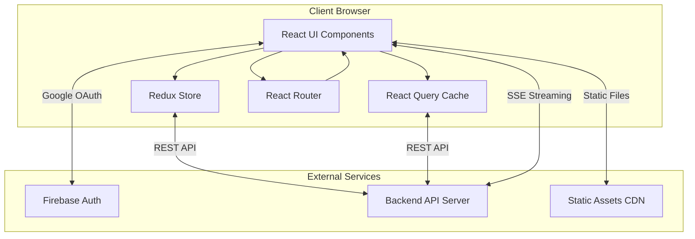

### System Context

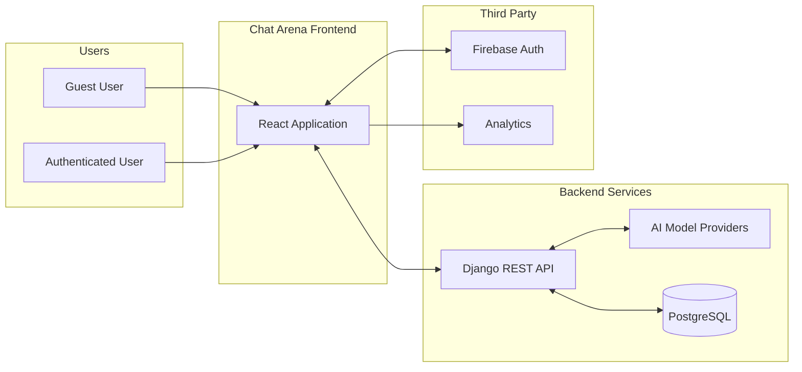

---

## Directory Structure

```
src/
├── app/                        # Application configuration
│   ├── store.js               # Redux store with middleware
│   ├── router.jsx             # Route definitions and guards
│   └── queryClient.js         # React Query configuration
│
├── config/
│   └── firebase.js            # Firebase initialization
│
├── features/                   # Feature modules (domain-driven)
│   ├── auth/
│   │   ├── components/        # LoginPage, AuthModal, UserPreferences
│   │   ├── services/          # userService (API calls)
│   │   └── store/             # authSlice (Redux)
│   │
│   ├── chat/
│   │   ├── components/        # 31 chat-related components
│   │   │   ├── ChatLayout.jsx       # Main layout wrapper
│   │   │   ├── ChatWindow.jsx       # Message display area
│   │   │   ├── ChatSidebar.jsx      # Session navigation
│   │   │   ├── MessageInput.jsx     # User input handling
│   │   │   ├── MessageList.jsx      # Single-model messages
│   │   │   ├── CompareView.jsx      # Dual-model comparison
│   │   │   ├── ModelSelector.jsx    # Model/mode selection
│   │   │   └── ...
│   │   ├── hooks/
│   │   │   ├── useStreamingMessage.js       # Single model streaming
│   │   │   ├── useStreamingMessageCompare.js # Dual model streaming
│   │   │   ├── useWebSocket.js              # WebSocket connection
│   │   │   ├── useGuestLimitations.js       # Guest quota management
│   │   │   └── usePrivacyConsent.js         # Consent handling
│   │   └── store/
│   │       └── chatSlice.js   # Chat state (sessions, messages, modes)
│   │
│   ├── leaderboard/
│   │   └── components/        # LeaderboardPage, FeedbackModal
│   │
│   ├── models/
│   │   └── store/
│   │       └── modelsSlice.js # Available models state
│   │
│   └── legal/
│       └── components/        # PrivacyPolicy, Terms, Maintenance
│
├── shared/                     # Shared utilities and components
│   ├── api/
│   │   ├── client.js          # Axios instance with interceptors
│   │   └── endpoints.js       # API endpoint constants
│   ├── components/
│   │   ├── ErrorBoundary.jsx  # Error boundary wrapper
│   │   └── Loading.jsx        # Loading spinner
│   ├── hooks/
│   │   ├── useDebounce.js
│   │   └── useLocalStorage.js
│   ├── icons/                 # Icon components
│   └── utils/                 # Utility functions
│
├── styles/
│   ├── globals.css            # Global styles, custom scrollbars
│   └── animations.css         # Animation keyframes
│
├── App.jsx                     # Root component with providers
├── App.css                     # Root component styles
└── index.js                    # Application entry point
```

---

## State Management

### Architecture Overview

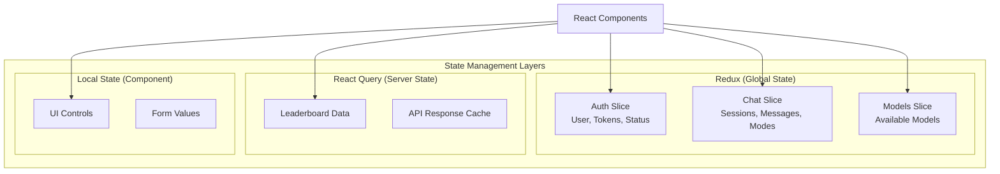

### Redux Slices

#### Auth Slice (`features/auth/store/authSlice.js`)

```javascript
// State Shape
{
  user: { id, email, displayName, isAnonymous, ... } | null,
  isAuthenticated: boolean,
  isAnonymous: boolean,
  loading: boolean,
  error: string | null,
  initialized: boolean,
  isUnderMaintenance: boolean
}

// Key Thunks
- loginWithGoogle()      // Firebase OAuth -> Backend JWT
- loginAnonymously()     // Create guest session
- fetchCurrentUser()     // Validate existing tokens
- updatePreferences()    // Update user settings
- refreshToken()         // Refresh JWT tokens
```

#### Chat Slice (`features/chat/store/chatSlice.js`)

```javascript
// State Shape
{
  sessions: Session[],
  activeSession: Session | null,
  messages: { [sessionId]: Message[] },
  streamingMessages: { [sessionId]: StreamingMessage },
  selectedMode: 'random' | 'direct' | 'compare',
  selectedModels: { modelA: Model | null, modelB: Model | null },
  isRegenerating: boolean,
  selectedLanguage: string,
  isTranslateEnabled: boolean
}

// Key Thunks
- createSession()        // Create new chat session
- fetchSessions()        // Load session history
- fetchSessionById()     // Load specific session

// Key Reducers (60+)
- setSelectedMode()
- setSelectedModels()
- addMessage()
- updateStreamingMessage()
- setActiveSession()
- ...
```

#### Models Slice (`features/models/store/modelsSlice.js`)

```javascript
// State Shape
{
  models: Model[],
  loading: boolean,
  error: string | null,
  testResults: { [modelId]: TestResult }
}

// Key Thunks
- fetchModels()          // Load available models
- testModel()            // Test model with prompt
```

### React Query Configuration

```javascript
// queryClient.js
const queryClient = new QueryClient({
  defaultOptions: {
    queries: {
      staleTime: 5 * 60 * 1000,      // 5 minutes
      cacheTime: 10 * 60 * 1000,     // 10 minutes
      retry: 1,
      refetchOnWindowFocus: false,
    },
  },
});
```

Used primarily for leaderboard data fetching.

---

## Data Flow

### Message Submission Flow

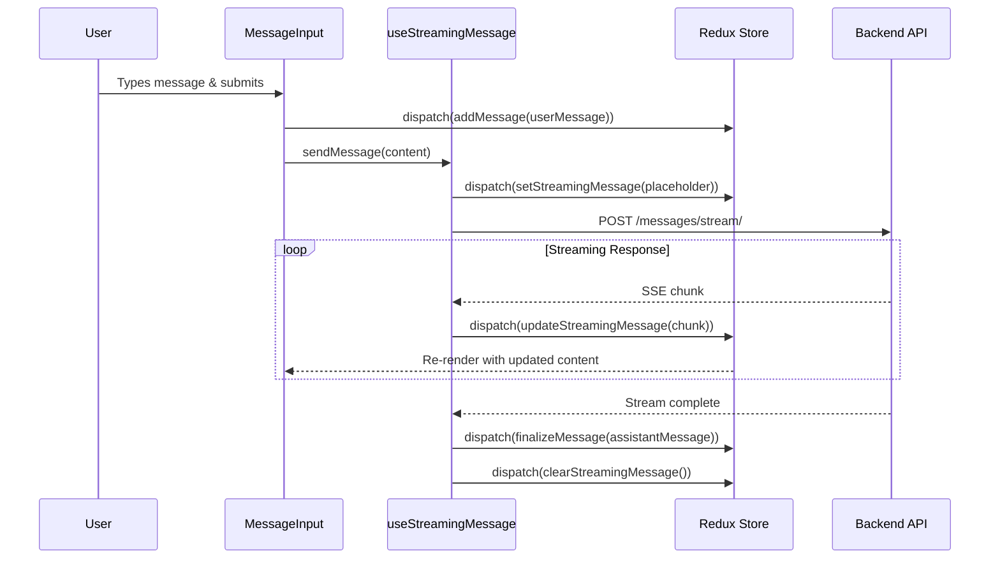

### Compare Mode Flow

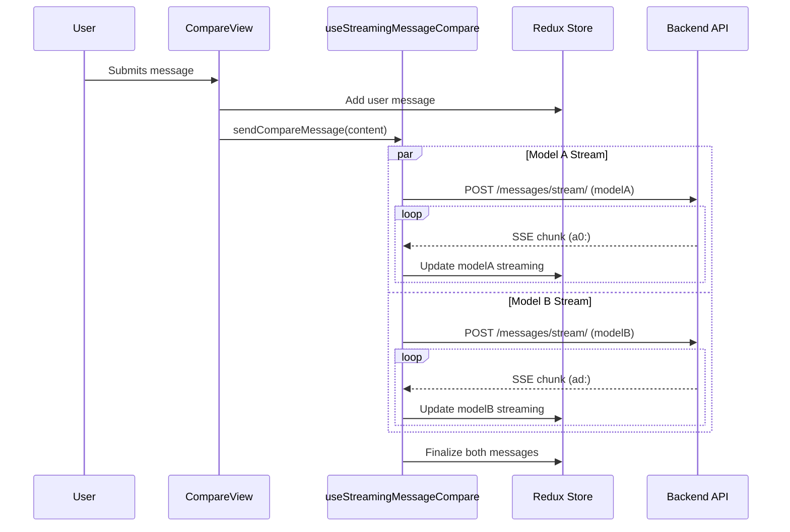

---

## API Integration Layer

### Axios Client Configuration

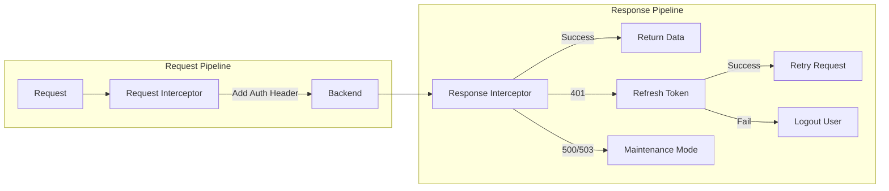

### Request Interceptor Logic

```javascript
// Adds authorization header
if (access_token) {
  headers['Authorization'] = `Bearer ${access_token}`;
} else if (anonymous_token) {
  headers['X-Anonymous-Token'] = anonymous_token;
}
// Skips for /auth/ and /public/ endpoints
```

### Response Interceptor Logic

```javascript
// 401 Handling
if (status === 401) {
  queue pending requests
  refresh access token
  retry queued requests with new token
  if refresh fails → logout
}

// 500/503 Handling
if (status === 500 || 503) {
  set maintenance mode
  route to maintenance page
}
```

### API Endpoints

| Category | Endpoint | Method | Description |
|----------|----------|--------|-------------|
| **Auth** | `/auth/google/` | POST | Google OAuth token exchange |
| | `/auth/anonymous/` | POST | Create anonymous session |
| | `/auth/refresh/` | POST | Refresh JWT tokens |
| | `/users/me/` | GET | Current user info |
| **Sessions** | `/sessions/` | GET/POST | List/create sessions |
| | `/sessions/{id}/` | GET | Session details |
| | `/sessions/{id}/share/` | POST | Generate share token |
| **Messages** | `/messages/stream/` | POST | Stream message response |
| | `/messages/{id}/regenerate/` | POST | Regenerate response |
| **Feedback** | `/feedback/` | POST | Submit feedback |
| | `/feedback/session_summary/` | GET | Session feedback stats |
| **Leaderboard** | `/leaderboard/` | GET | Model rankings |
| | `/leaderboard/categories/` | GET | Available categories |

---

## Routing Strategy

### Route Configuration

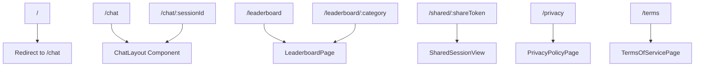

### Route Structure

```javascript
// router.jsx
const routes = [
  { path: '/', element: <Navigate to="/chat" /> },
  { path: '/chat', element: <ChatLayout /> },
  { path: '/chat/:sessionId', element: <ChatLayout /> },
  { path: '/leaderboard', element: <LeaderboardPage /> },
  { path: '/leaderboard/:category', element: <LeaderboardPage /> },
  { path: '/shared/:shareToken', element: <SharedSessionView /> },
  { path: '/privacy', element: <PrivacyPolicyPage /> },
  { path: '/terms', element: <TermsOfServicePage /> },
];
```

### Router Type

Uses `HashRouter` for compatibility with static hosting (routes appear as `/#/chat`).

---

## Authentication Flow

### Authentication Initialization

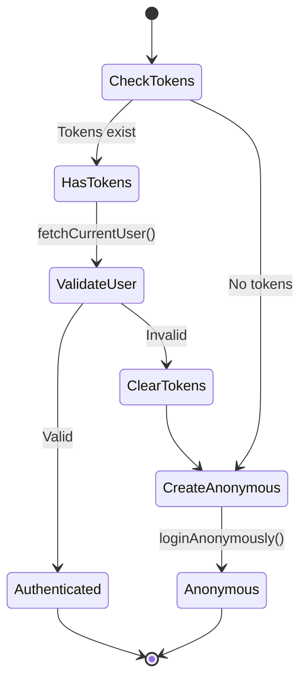

### Google OAuth Flow

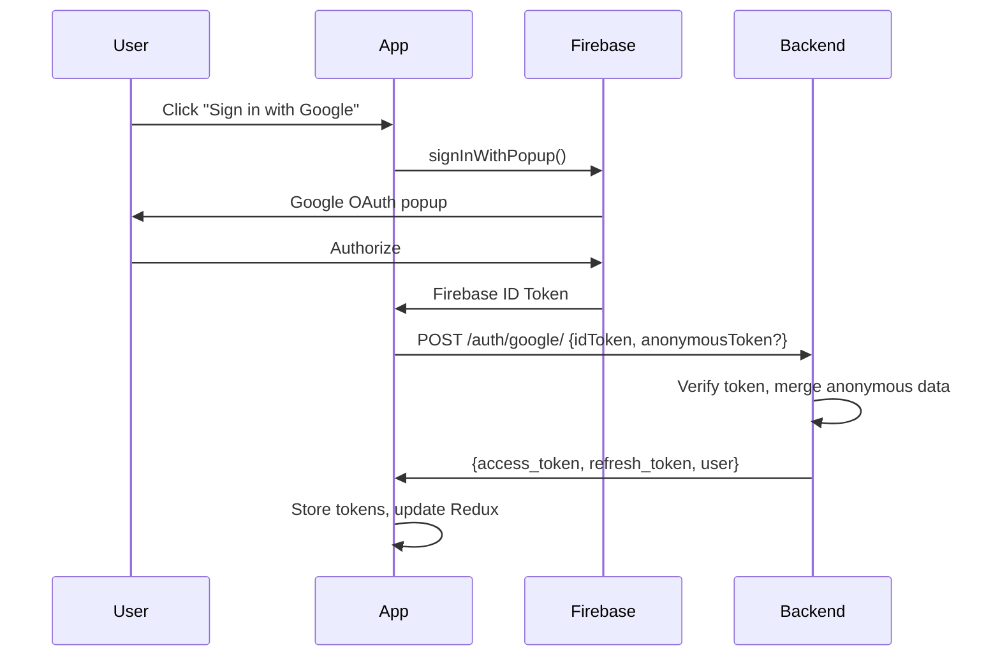

### Token Storage

| Token | Storage | Purpose |
|-------|---------|---------|
| `access_token` | localStorage | API authentication (short-lived) |
| `refresh_token` | localStorage | Token refresh (long-lived) |
| `anonymous_token` | localStorage | Guest identification |

---

## Real-time Streaming

### SSE Streaming Architecture

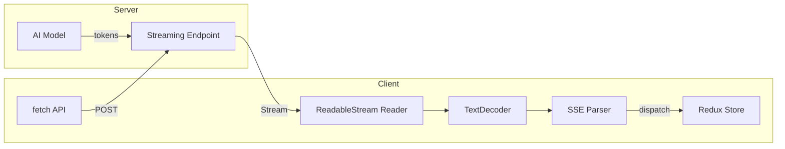

### Stream Message Format

```
// Single model response
data: {"content": "Hello", "status": "streaming"}
data: {"content": " world", "status": "streaming"}
data: {"content": "!", "status": "complete"}

// Compare mode (prefixed)
a0: {"content": "Model A says...", "participant": "a"}
ad: {"content": "Model B says...", "participant": "b"}
```

### Buffering Strategy

```javascript
// Buffer updates for 75ms before flushing to Redux
// Reduces render frequency during fast streaming
const FLUSH_INTERVAL = 75;
let buffer = '';

function onChunk(chunk) {
  buffer += chunk;
}

setInterval(() => {
  if (buffer) {
    dispatch(updateStreamingMessage(buffer));
    buffer = '';
  }
}, FLUSH_INTERVAL);
```

---

## Error Handling Strategy

### Error Boundary

```jsx
// Wraps entire application
<ErrorBoundary fallback={<ErrorPage />}>
  <App />
</ErrorBoundary>
```

### API Error Handling

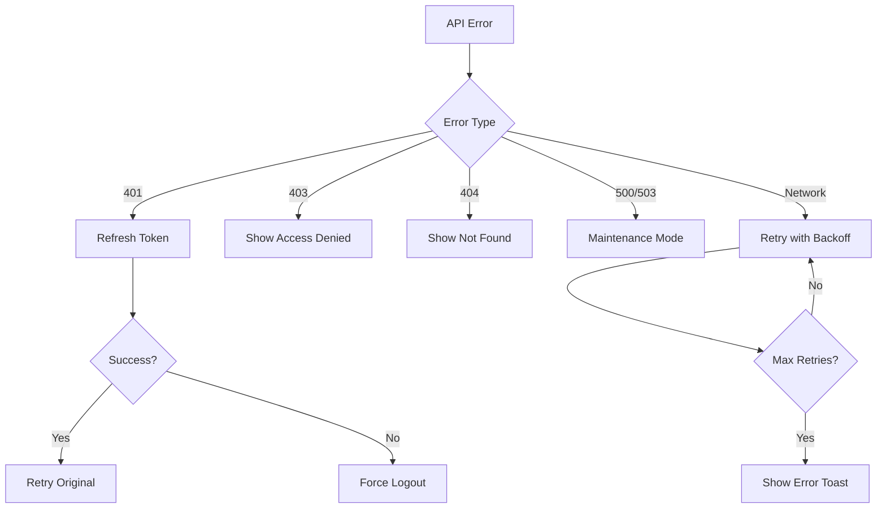

### Streaming Error Handling

```javascript
try {
  for await (const chunk of stream) {
    // Process chunk
  }
} catch (error) {
  dispatch(setMessageError({
    messageId,
    error: error.message
  }));
  // User can regenerate failed messages
}
```

---

## Performance Considerations

### Optimization Techniques

1. **Code Splitting**: Routes are lazily loaded
2. **Memoization**: Heavy components use `React.memo`
3. **Virtual Lists**: Long message lists use windowing
4. **Debouncing**: Search and input handlers debounced
5. **Stream Buffering**: 75ms buffer reduces render frequency

### Caching Strategy

| Data Type | Cache Location | TTL |
|-----------|---------------|-----|
| User session | Redux + localStorage | Session |
| Chat sessions | Redux | Session |
| Messages | Redux | Session |
| Models list | Redux | Session |
| Leaderboard | React Query | 5 minutes |
| Static assets | Browser cache | Long-term |

### Bundle Optimization

- Tree shaking enabled via CRA
- CSS purging via Tailwind
- Image optimization via CDN
- Gzip compression on deployment

---

## Diagrams Reference

All architecture diagrams in this document use [Mermaid](https://mermaid.js.org/) syntax and render natively in GitHub and most modern markdown viewers.

For offline viewing, you can use:
- [Mermaid Live Editor](https://mermaid.live/)
- VS Code Mermaid extension
- Any Mermaid-compatible viewer

---

## Related Documentation

- [Getting Started Guide](docs/guides/getting-started.md)
- [Local Development](docs/guides/local-development.md)
- [Internal API Documentation](docs/api/internal-api.md)
- [Architecture Decision Records](docs/architecture/decisions/)
