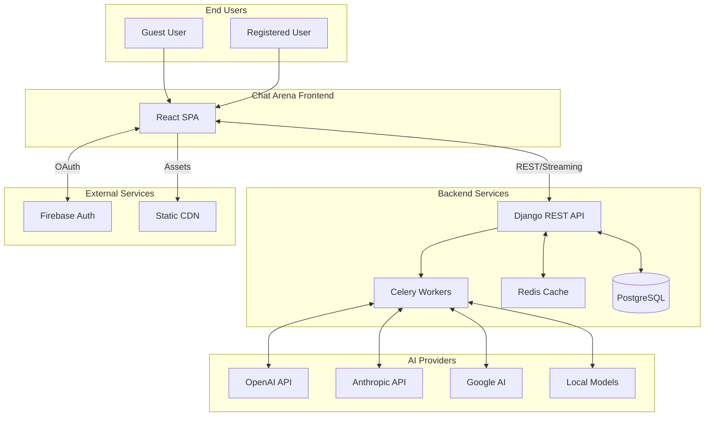
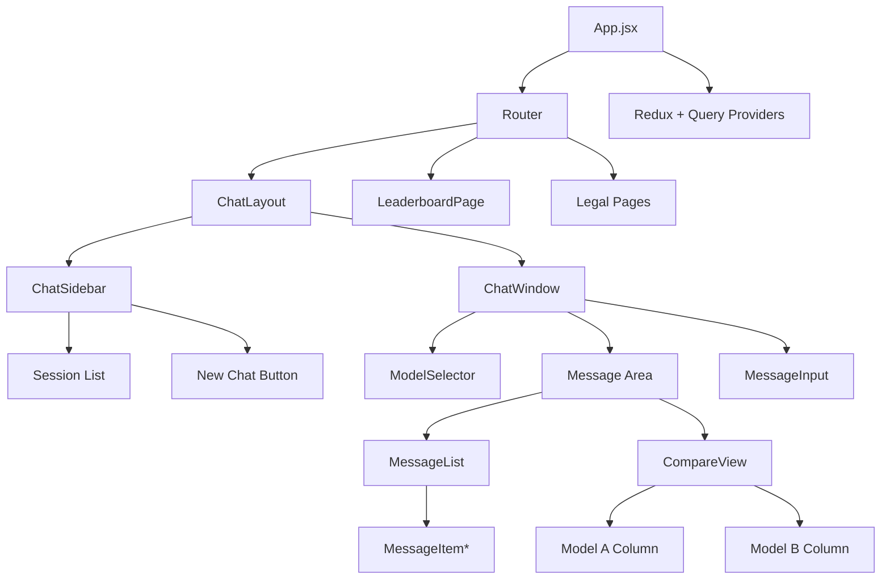
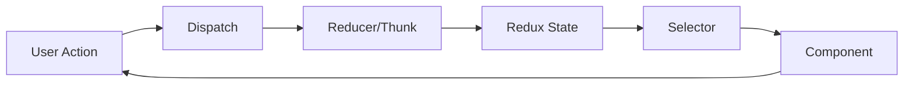
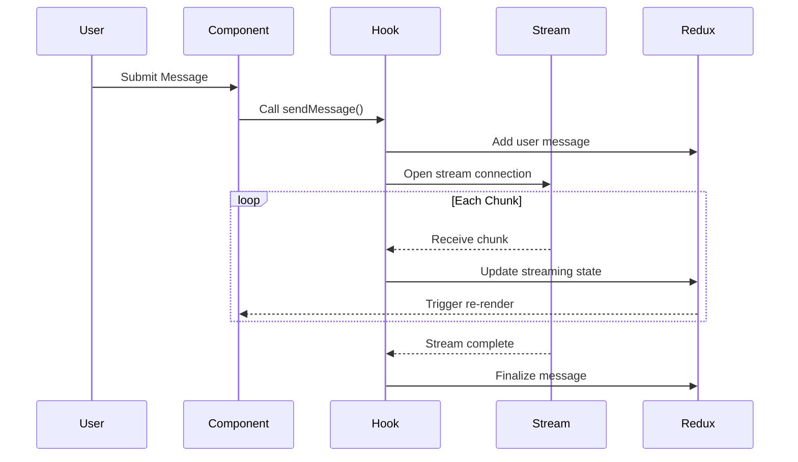
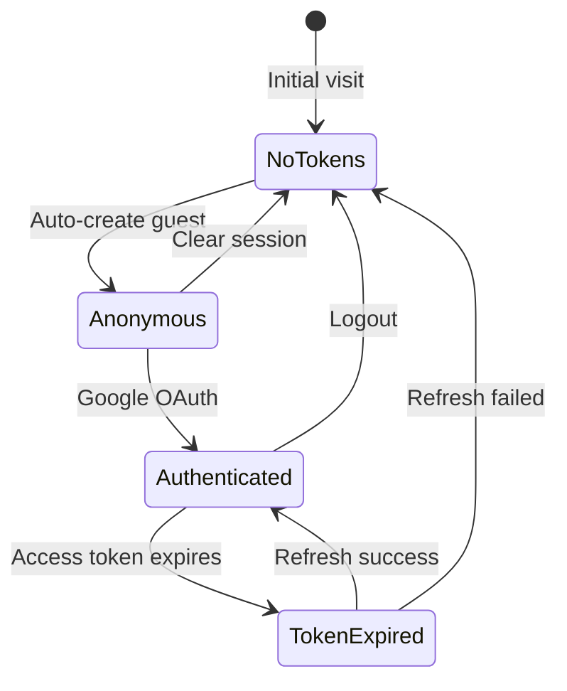

# System Overview

This document provides a comprehensive view of the Chat Arena system architecture and how the frontend interacts with external systems.

## System Context

Chat Arena is an AI model evaluation platform that allows users to interact with and compare various AI models. The frontend is a React single-page application that communicates with a Django REST backend.



## Frontend Architecture Layers

### Presentation Layer

The UI is built with React 19 and organized into feature-based modules:

```
┌─────────────────────────────────────────────────────────────┐
│                    Presentation Layer                        │
├─────────────┬─────────────┬─────────────┬──────────────────┤
│    Auth     │    Chat     │ Leaderboard │      Legal       │
│  Components │  Components │  Components │   Components     │
├─────────────┴─────────────┴─────────────┴──────────────────┤
│                   Shared Components                          │
│         (ErrorBoundary, Loading, Icons, etc.)               │
└─────────────────────────────────────────────────────────────┘
```

### State Management Layer

State is managed through three tiers:

```
┌─────────────────────────────────────────────────────────────┐
│                  State Management Layer                      │
├─────────────────────────────┬───────────────────────────────┤
│      Redux (Global State)   │   React Query (Server Cache)  │
│  ┌───────────────────────┐  │  ┌─────────────────────────┐  │
│  │ Auth Slice            │  │  │ Leaderboard Queries     │  │
│  │ Chat Slice            │  │  │ Cached API Responses    │  │
│  │ Models Slice          │  │  │                         │  │
│  └───────────────────────┘  │  └─────────────────────────┘  │
├─────────────────────────────┴───────────────────────────────┤
│                   Local Component State                      │
│              (useState, useReducer in components)           │
└─────────────────────────────────────────────────────────────┘
```

### Service Layer

API communication is centralized through the Axios client:

```
┌─────────────────────────────────────────────────────────────┐
│                     Service Layer                            │
├─────────────────────────────────────────────────────────────┤
│                    Axios HTTP Client                         │
│  ┌─────────────────────┐  ┌─────────────────────────────┐  │
│  │ Request Interceptor │  │   Response Interceptor      │  │
│  │ - Add auth headers  │  │   - Handle 401 (refresh)    │  │
│  │ - Skip for public   │  │   - Handle 500 (maintenance)│  │
│  └─────────────────────┘  └─────────────────────────────┘  │
├─────────────────────────────────────────────────────────────┤
│                  Streaming Service                           │
│  ┌─────────────────────┐  ┌─────────────────────────────┐  │
│  │ Fetch + ReadableStr │  │   SSE Parser               │  │
│  │ (Real-time stream)  │  │   (Process chunks)          │  │
│  └─────────────────────┘  └─────────────────────────────┘  │
└─────────────────────────────────────────────────────────────┘
```

## Component Architecture

### Feature Module Structure

Each feature follows a consistent structure:

```
features/
└── feature-name/
    ├── components/          # React components
    │   ├── FeaturePage.jsx # Main page component
    │   ├── FeatureList.jsx # List component
    │   └── FeatureItem.jsx # Item component
    ├── hooks/               # Custom hooks
    │   └── useFeature.js   # Feature-specific logic
    ├── services/            # API calls
    │   └── featureService.js
    ├── store/               # Redux slice
    │   └── featureSlice.js
    └── index.js             # Public exports
```

### Component Hierarchy



## Data Flow Patterns

### Unidirectional Data Flow



### Streaming Data Flow



## Security Architecture

### Authentication Layers

```
┌───────────────────────────────────────────────────────────┐
│                    Authentication Flow                     │
├───────────────────────────────────────────────────────────┤
│  Layer 1: Firebase Authentication                         │
│  - Google OAuth provider                                  │
│  - ID token generation                                    │
├───────────────────────────────────────────────────────────┤
│  Layer 2: Backend JWT                                     │
│  - Access token (short-lived)                            │
│  - Refresh token (long-lived)                            │
│  - Anonymous token (guest sessions)                      │
├───────────────────────────────────────────────────────────┤
│  Layer 3: Request Authorization                          │
│  - Bearer token in Authorization header                  │
│  - Auto-refresh on 401                                   │
│  - Secure token storage (localStorage)                   │
└───────────────────────────────────────────────────────────┘
```

### Token Lifecycle



## External Integrations

### Firebase Authentication

| Purpose | Configuration |
|---------|--------------|
| Provider | Google OAuth 2.0 |
| Popup | Sign-in popup flow |
| Token | Firebase ID token exchanged for backend JWT |
| Merge | Anonymous sessions merged on sign-in |

### Backend API

| Endpoint Category | Base Path | Auth Required |
|-------------------|-----------|---------------|
| Authentication | `/api/auth/` | No |
| Users | `/api/users/` | Yes |
| Sessions | `/api/sessions/` | Yes |
| Messages | `/api/messages/` | Yes |
| Feedback | `/api/feedback/` | Yes |
| Leaderboard | `/api/leaderboard/` | No |
| Models | `/api/models/` | Partial |

### CDN/Static Assets

- Static assets served from CDN in production
- Images, fonts, and compiled JS/CSS bundles
- Cache headers configured for optimal performance

## Deployment Architecture

```mermaid
graph TB
    subgraph "Development"
        Dev[npm start]
        DevServer[Dev Server :3000]
        Dev --> DevServer
    end

    subgraph "Build"
        Build[npm run build]
        Static[Static Bundle]
        Build --> Static
    end

    subgraph "Production"
        CDN[CDN Edge]
        Static --> CDN
        User[User Browser]
        User --> CDN
    end
```

## Performance Architecture

### Caching Strategy

| Data | Location | TTL | Invalidation |
|------|----------|-----|--------------|
| Static assets | CDN + Browser | Long | Version hash |
| User session | Redux + localStorage | Session | Logout |
| Chat messages | Redux | Session | Session change |
| Leaderboard | React Query | 5 min | Manual/Time |
| Models list | Redux | Session | Refresh |

### Optimization Techniques

1. **Code Splitting**: Route-based lazy loading
2. **Memoization**: React.memo for expensive renders
3. **Virtualization**: Windowed lists for long conversations
4. **Debouncing**: Input handlers with 300ms delay
5. **Stream Buffering**: 75ms buffer for streaming updates

## Monitoring Points

### Client-Side Observability

| Metric | Source | Purpose |
|--------|--------|---------|
| Page Load | Web Vitals | Performance baseline |
| API Latency | Axios interceptors | Backend health |
| Error Rate | Error boundary | Stability tracking |
| Stream Duration | Streaming hooks | AI response time |
| User Actions | Event handlers | Usage analytics |

---

## Related Documentation

- [Architecture Decision Records](decisions/)
- [API Integration](../api/internal-api.md)
- [Getting Started](../guides/getting-started.md)